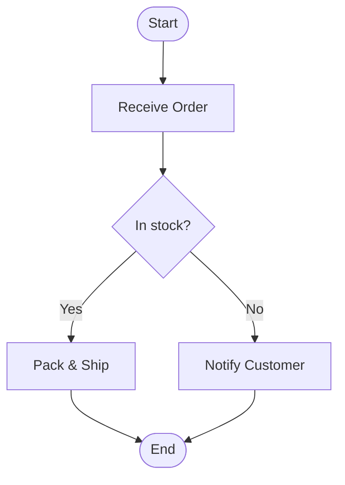
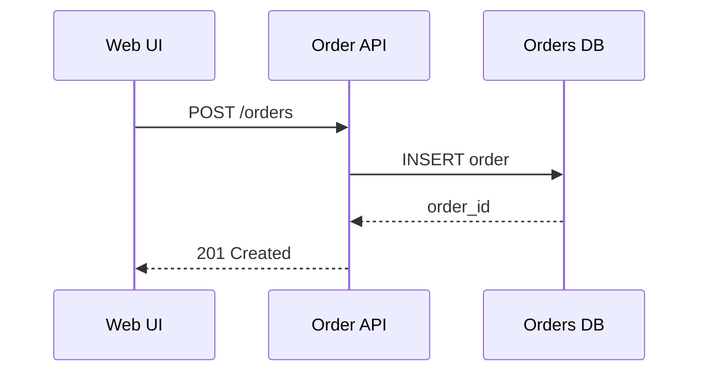
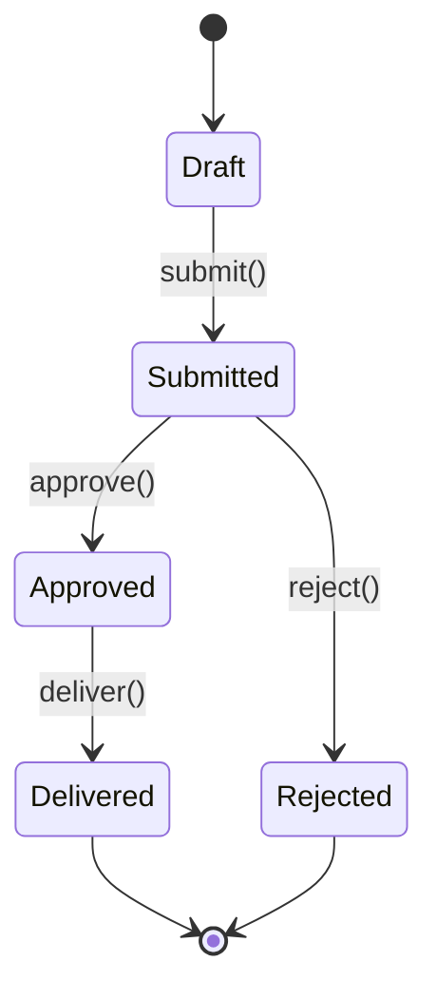
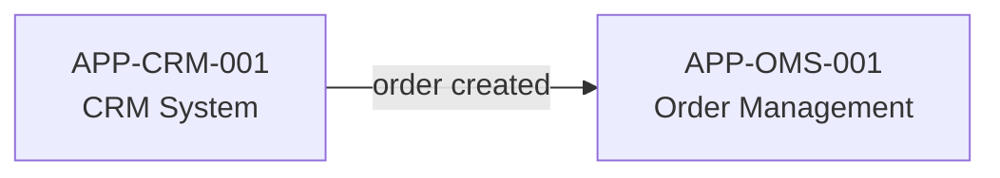

# Activity Diagrams — Mermaid Reference

**Scope:** Quick activity, sequence, flow, and state diagrams using the Mermaid standard. Used when a lightweight diagram is needed without the full BPMN apparatus.
**Renderer:** Mermaid (external standard — rendered natively by GitHub, VS Code, and most Markdown viewers)

---

## File header

Every `*.activities.transitrix.yaml` file MUST start with the following header:

```yaml
notation: activities    # required; this notation's short name
spec_version: 0.1       # optional today; reserved field; will be required when this notation reaches v1.0
# … rest of the document
```

Validator behaviour:
- Missing `notation` → hard error.
- `notation` value not equal to `activities` → hard error (the file might be the wrong format for this extension).
- File extension not equal to `.activities.transitrix.yaml` while `notation: activities` → hard error (extension/content mismatch).
- `spec_version` accepted but not enforced until this notation hits v1.0.

---

## 1. Overview

Mermaid diagrams are the lightweight alternative to BPMN in Transitrix. They require no compiler and render natively in most Markdown environments. Use them for:

- Simple activity flows (no swimlanes needed)
- Sequence diagrams between systems
- State machine diagrams
- Quick flowcharts in documentation

For processes that need swimlanes, KPIs, ArchiMate references, or export to BPMN XML, use the BPMN notation (`*.bpmn.transitrix.yaml`) instead.

---

## 2. When to use Mermaid vs BPMN

| Need | Use |
|------|-----|
| Quick inline diagram in a `.md` document | Mermaid |
| Swimlanes with roles and systems | BPMN |
| System sequence diagram | Mermaid |
| KPIs and data flow in a process | BPMN |
| State machine | Mermaid |
| Export to BPMN XML for tooling | BPMN |
| Diagram is bound to one document | Mermaid (inline) |
| Diagram is a standalone architecture artefact | BPMN or stand-alone `.mmd` file |

---

## 3. File location and naming

Stand-alone diagrams:
```
views/activities/<NAME>.mmd
```

Inline (in a Markdown document):
```markdown
\`\`\`mermaid
flowchart TD
    ...
\`\`\`
```

---

## 4. Diagram types used in Transitrix

### 4.1 Flowchart (activity diagram)



### 4.2 Sequence diagram



### 4.3 State diagram



---

## 5. Naming nodes

Node labels should use the same terminology as the glossary. For nodes that represent architectural elements, include the element ID in the label or a comment:



---

## 6. Conventions in Transitrix

- Start and end nodes: rounded rectangle `([...])` or circle `((...))` for terminal states
- Decision nodes: diamond `{...}`
- External actors: stadium `([...])` or named participant in sequence diagrams
- Include a title using `---\ntitle: ...\n---` frontmatter when saving as a stand-alone `.mmd` file
- Keep diagrams to a single page — split into multiple files if needed

---

## 7. References

- Mermaid documentation: [https://mermaid.js.org/](https://mermaid.js.org/)
- BPMN notation (for complex processes): `notations/02-bpmn.md`
- Methodology section 6 (notation #3): `method/methodology.md`
